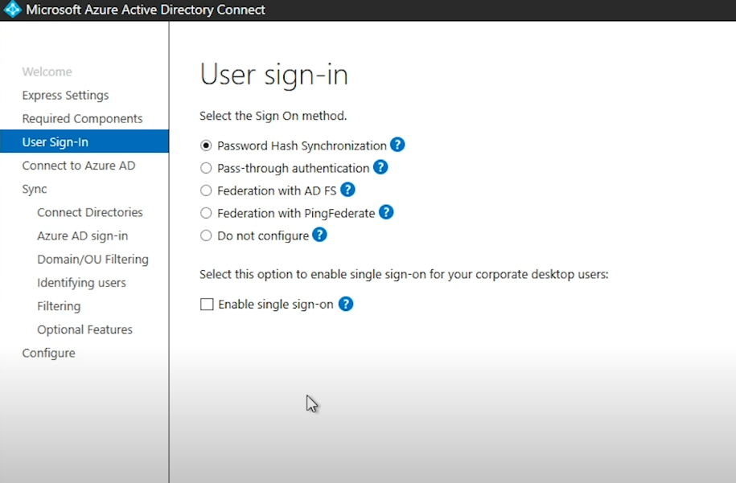

# Introduction

In my previous posts, I talked about my homelab, a local setup where I could test and learn. Today, I want to share how I took a big step: I connected my local network to Microsoft's cloud services, Azure. This change helped me use cool tools from Azure without giving up my local files and settings.

## Part 1: Linking My Local Network to Azure with Azure AD Connect

First, I needed a way to make sure my local network and Azure could share information about users and computers. For this, I used a tool called Azure AD Connect. To be clear, this is after I downloaded and set up my Windows Server 2019 and downloaded AD DS on it (promoting it to be a domain controller).

## Getting Started with Azure AD Connect

**Installing the Tool**: I downloaded Azure AD Connect and chose the 'Custom' settings so I could pick exactly what I wanted. This step made sure I had control over what was shared between my local network and Azure.

**Authentication**: Make sure to use "**Password Hash Synchronization**" as seen below. This feature allows the on-prem passwords to hashed several times. The password's MD5 hash is iterated through SHA256 about 1,000 times and the final hash is sent over to Azure.
- **Pass-through authentication** works by instead of the authentication taking place in the cloud, the request is passed from Azure AD to an on-premise domain controller. This controller then performs a Win32 logon to verify your credentials, allowing you to access the environment securely. This method ensures that the actual authentication happens within your local premises, providing an extra layer of security as your passwords don't need to be stored in the cloud.

**Making Sure Everything Syncs**: After setting things up, Azure AD Connect started sharing information between my network and Azure. I checked to make sure all the details were correct and that nothing was missing. It is also possible to use the Synchronization Service Manager to view the syncs.

- Here it shows that it fulfilled the first import and has been doing synchronizations routinely. If needed, manual pushes to azure is possible. 

To confirm, Azure is now populating users from the DC and is highlighting that on-premises sync is enabled.

## Conclusion
With Azure AD Connect successfully implemented, we've established a hybrid Active Directory framework. This  integration means any objects — devices, users, or groups — initiated in the on-premise Domain Controller are synchronized with the cloud, setting the stage for centralized management.

In the next post, we'll delve into optimizing device management, a task made intuitive through **Intune**. Intune stands out in deploying critical safeguards for identity management, orchestrating policies, and constructing organized groups for streamlined administration.

In the future, we will go over identity protection, as well as delving deeper into Microsoft Defender for Identity/Endpoint where we will see how attacks are detected, audited, and responded to.